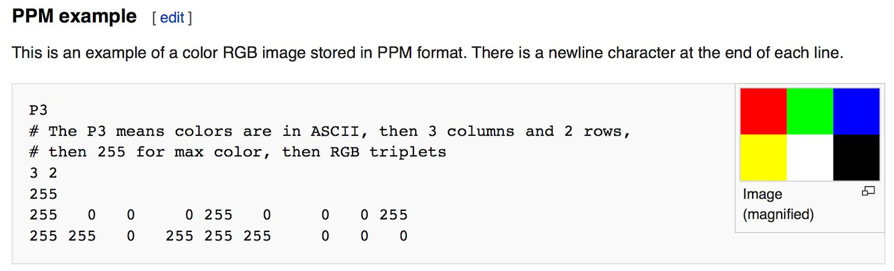
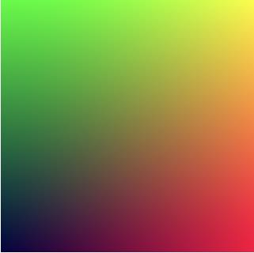
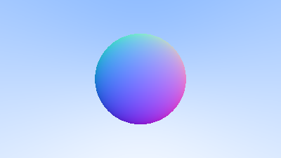
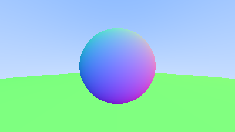
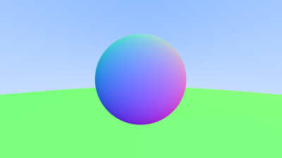

# EasyRayTracing Project

该项目为一个简单的光追项目，整个流程参考了教程[Ray tracing in one weekend](https://raytracing.github.io/books/RayTracingInOneWeekend.html)，同时记录一下完成项目的过程中一些自己的想法，如果哪里想错了欢迎指正，也希望能够真的如标题所说一个周末完成，搞完这个项目就接着回去看opengl，换换口味。整个教程大概12节的内容，那就每完成一节就总结一下好了。

因为这个教程用最基础的C++功能完成了整个渲染流程，也没有借助别的图形API，所以整个工作环境也就用了Visual studio 2019，建个C++项目就可以开搞了，那就走起。

## · 创建图片文件
为了简化渲染流程，我们最终渲染得到的结果为一张PPM格式的图片，PPM的内容如下所示：<br />

如注释所说，第一行P3代表颜色都以ASCII码的形式编写，下面的3 2代表我这张图3行2列的像素，255代表颜色的最大值，然后就是六个RGB值。PPM可以用各类图片浏览软件打开，比如photoshop，如果没有又懒得装，教程中提供了一个在线加载PPM图片的网站[PPM Viewer](https://www.cs.rhodes.edu/welshc/COMP141_F16/ppmReader.html)。

那我们就先来创建一张图片试试，代码如下，我们创建了一张256*256大小的图片，循环里写入rgb值，red值从左到右越来越大，green值从上到下越来越小，中间红色和绿色混在一起就是黄色。因为我们用了cout输出流来输出PPM文件的内容，所以如果我们想让程序输出一些进度信息就需要用其他的输出流，所以这里用了cerr，flush用于刷新流缓冲区。
```
#include <iostream>

int main() {
	const int image_width = 256;
	const int image_height = 256;
	std::cout << "P3\n" << image_width << ' ' << image_height << "\n255\n";

	for (int j = image_height - 1; j >= 0; --j) {
		std::cerr << "\rScanlines remainin:" << j << ' ' << std::flush;
		for (int i = 0; i < image_width; ++i) {
			auto r = double(i) / (image_width - 1);
			auto g = double(j) / (image_height - 1);
			auto b = 0.25;

			int ir = static_cast<int>(255.999 * r);
			int ig = static_cast<int>(255.999 * g);
			int ib = static_cast<int>(255.999 * b);

			std::cout << ir << ' ' << ig << ' ' << ib << '\n';
		}
	}
	
	std::cerr << "\nDone.\n";
```
编译出exe文件后，在cmd里输入```EasyRaytracing > image.ppm```, 这样程序就能将PPM内容输入到image.ppm文件中，就得到了这样一张炫酷的图片。<br />


## · Vec3类
很多图形程序都会为向量、颜色设计class，而且基本上都是四维，对于向量坐标来说，出了xyz三个维度以外，还有一个齐次分量用于投影变换，对于颜色来说第四维就是alpha透明度通道，但是本项目还是从简的目的，将向量和颜色都设计为一个Vec3的类型，头文件vec3.h就是用于该类型的设计，这个做法其实还是不太好的，有时候不小心把向量和颜色加起来，程序本身不会有报错提示，因为都是同样的类型，还是那句话，本项目从简。。为了让向量和颜色有稍许的区别，我们还是在C++中给color和point3设置了各自的别名，但本质上还是vec3。<br />
在vec3.h中，我们设置了各种运算符重载，还用到了内敛函数，因为向量的计算在渲染过程中是频繁用到的，如果每次程序都去调用函数到内存中，效率也太低了，所以用内联函数直接在函数被调用的时候进行展开，用空间换时间。有了头文件之后，我们把渲染程序精简一下，编译完再生成一下ppm图片，没啥问题就继续下一节。
```
#include "color.h"
#include "vec3.h"

#include <iostream>

int main() {
	const int image_width = 256;
	const int image_height = 256;
	std::cout << "P3\n" << image_width << ' ' << image_height << "\n255\n";

	for (int j = image_height - 1; j >= 0; --j) {
		std::cerr << "\rScanlines remainin:" << j << ' ' << std::flush;
		for (int i = 0; i < image_width; ++i) {
			color pixel_color(double(i) / (image_width - 1), double(j) / (image_height - 1), 0.25);
			write_color(std::cout, pixel_color);
		}
	}
	
	std::cerr << "\nDone.\n";
}
```

## · 光线，简单的摄像机以及背景设置
光追最关键的就是光线的定义，我们将光线视为一个向量，用函数表示为 P(t)=A+tb，其中A为光线的起点，b为光线的方向，t为我们自己定义的一个数值，其代表这个向量的长度，更重要的是t的正负值可以让我们的光线正向反向进行传播。头文件ray.h定义了这样一个光线的类型。<br />
然后我们将光线射向场景中，然后把光线击中的所有像素的颜色加起来就能得到最终颜色，光线追踪的过程主要分为三步：首先，计算从视角出发的光线到像素的整个路径，本项目中摄像机的位置就是视角的位置；然后计算出路径中光线接触到了哪些物体；最后将光线和各个物体接触点的颜色相加。那我们定义了光线之后，就来把main函数改写一下：
```
color ray_color(const ray& r) {
	vec3 unit_direction = unit_vector(r.direction());
	auto t = 0.5 * (unit_direction.y() + 1.0);
	return (1.0 - t) * color(1.0, 1.0, 1.0) + t * color(0.5, 0.7, 1.0);
}

int main() {
	//image
	const auto aspect_ratio = 16.0 / 9.0;
	const int image_width = 400;
	const int image_height = static_cast<int>(image_width/aspect_ratio);
	
	//camera
	auto viewport_height = 2.0;
	auto viewport_width = aspect_ratio * viewport_height;
	auto focal_length = 1.0;

	auto origin = point3(0, 0, 0);
	auto horizontal = vec3(viewport_width, 0, 0);
	auto vertical = vec3(0, viewport_height, 0);
	auto lower_left_corner = origin - horizontal / 2 - vertical / 2 - vec3(0, 0, focal_length);

	//render
	std::cout << "P3\n" << image_width << ' ' << image_height << "\n255\n";

	for (int j = image_height - 1; j >= 0; --j) {
		std::cerr << "\rScanlines remainin:" << j << ' ' << std::flush;
		for (int i = 0; i < image_width; ++i) {
			auto u = double(i) / (image_width - 1);
			auto v = double(j) / (image_height - 1);
			ray r(origin, lower_left_corner + u * horizontal + v * vertical - origin);
			color pixel_color = ray_color(r);
			write_color(std::cout, pixel_color);
		}
	}
	
	std::cerr << "\nDone.\n";
}
```
在main函数之前，我们定义了一个write_color函数，参数为我们当前视角到某个像素的一条光线，首先我们取光线在y轴方向上的标准化的值，其范围为(-1,1)，那t的范围就是(0,1)，这个t就相当于一个权重，用来计算我当前像素的颜色值中白色和蓝色的比重，可以看到t越大蓝色值占比越高，在渲染出来的图片中可以看到就是一个渐变的蓝色图片。<br />
那在main函数中，我们将图片长宽比设为16比9，然后循环遍历每个像素计算颜色值，u和v类似于NDC坐标，它的值被限制到0到1的范围，然后我们用图片左下角的位置计算便宜，得到像素在图片中的位置，也就是r变量构造函数的参数所作的事情。图片左下角的位置我们用变量lower_left_corner来表示，可以看到origin代表我摄像机的位置，它的xy也就是图片的中心，然后在z轴方向有一个focal_length的距离。编译运行，得到最终渲染结果。<br />


## · 加个球~
现在我们在场景中添加一个球来直观地表现光线击中物体得到不同颜色的情况。首先来复习一下高中数学，我们假设球心的坐标为(C<sub>x</sub>,C<sub>y</sub>,C<sub>z</sub>)，半径为r，那就能得到这个球的函数：<br />
$$(x-C_x)^2+(y-C_y)^2+(z-C_z)^2=r^2$$
现在我们有了光线的函数，假设光线与这个球相交或者相切，也就是光线P上至少有一个点到球心的距离等于半径，即：
$$(P-C)^2=r^2$$
我们有光线P关于t的函数式，带入并展开可以得到一个关于t的二元一次方程：
$$t^2b·b+2tb·(A-C)+(A-C)^2-R^2=0$$
这个式子看似复杂，其实只有一个未知量t，所以我们用b<sup>2</sup>-4ac的正负或零来判断这个方程是否有解，式子大于0有两个解也就是光线与球相交，等于0一个解代表光线与球面相切，小于0那就是光线与球没有交点。知道了原理，那就用代码实现一下。
```
bool hit_sphere(const point3& center, double radius, const ray& r) {
	vec3 oc = r.origin() - center;
	auto a = dot(r.direction(), r.direction());
	auto b = 2.0 * dot(oc, r.direction());
	auto c = dot(oc, oc) - radius * radius;
	auto discriminant = b * b - 4 * a * c;
	return (discriminant > 0);
}
```
我们用这个函数判断光线是否与球面相交，值得注意的是在二元一次方程中，A为光线的起点，也就是当前场景的原点，C为球心，所以A-C用代码表示为原点到球心的向量，所以是变量oc。r.direction()是二次方程中的b，因为代表了光线的方向。随后我们修改一下确定光线颜色的函数：
```
color ray_color(const ray& r) {
	if (hit_sphere(point3(0, 0, -1), 0.5, r))
		return color(1, 0, 0);
	vec3 unit_direction = unit_vector(r.direction());
	auto t = 0.5 * (unit_direction.y() + 1.0);
	return (1.0 - t) * color(1.0, 1.0, 1.0) + t * color(0.5, 0.7, 1.0);
}
```
在最前面加了一个if判断，也就是在光线与球心在(0,0,-1)半径为-1的球有交点时，该像素点颜色为红色，否则还是之前的渐变蓝色。有一个问题是，还记得之前t的正负值代表光线的正向和反向吗，目前t是有可能为负值的，也就是说哪怕这个球的位置在光线起点的后面，也是会得到交点，我们会在后续修复这个问题。程序没有问题的情况下得到最终效果：<br />


## · 表面的法向和多个物体
### ·· 根据表面法线进行着色
对于球心为C的球体，假设球体表面的点为P，则P点处的法线向量应该为P-C。由于目前我们场景中还没有添加任何光线，那我们为了可视化法线的效果，我们根据法线的坐标值设置球体表面像素的rgb颜色。<br />
之前我们用函数hit_sphere判断光线是否与球体相交，所以函数返回值为bool类型，但是现在我们需要交点P的值了，根据之前我们推导出来的交点坐标公式，可以知道我们能够用t的值来表示交点P的坐标，所以我们当前的目的就是用hit_sphere函数返回t的值，那返回值自然也将改成double类型。为了简化场景，我们假设当前球体是在摄像机的前面，即球心z值为-1，那就不需要考虑t为负值的情况，利用求根公式
$$x=(-b \pm \sqrt \delta) /2a$$
我们取t的最小值，也就是光线最先接触到球体的点（后一个接触的点会被遮挡住，不需要渲染，也就是上述求根公式括号内为减号。在ray_color函数中，如果t值大于零，也就是有交点，那我用该点减去球心(0,0,-1)就能得到该点的法向量，进行一个标准化，然后映射到rgb值上去，得到球体的法线可视化效果。
```
double hit_sphere(const point3& center, double radius, const ray& r) {
	vec3 oc = r.origin() - center;
	auto a = dot(r.direction(), r.direction());
	auto b = 2.0 * dot(oc, r.direction());
	auto c = dot(oc, oc) - radius * radius;
	auto discriminant = b * b - 4 * a * c;
	if (discriminant < 0) {
		return -1.0;
	}
	else {
		return (-b - sqrt(discriminant)) / (2.0 * a);
	}
}

color ray_color(const ray& r) {
	auto t = hit_sphere(point3(0, 0, -1), 0.5, r);
	if (t > 0.0) {
		vec3 N = unit_vector(r.at(t) - vec3(0, 0, -1));
		return 0.5 * color(N.x() + 1, N.y() + 1, N.z() + 1);

	}

	vec3 unit_direction = unit_vector(r.direction());
	t = 0.5 * (unit_direction.y() + 1.0);
	return (1.0 - t) * color(1.0, 1.0, 1.0) + t * color(0.5, 0.7, 1.0);
}
```
编译成功后运行即可得到法线可视化图片：<br />


### ··简化光球相交的函数
对于求根公式，我们把其中的b替换成2h，相当于h大小为b的一半，带入到求根公式可得
$$x=(-h \pm \sqrt (h^2-ac))/a$$
同时，相同向量的点积我们可以替换为这个向量长度的平方，所以hit_sphere可以减少一些计算量：
```
double hit_sphere(const point3& center, double radius, const ray& r) {
	vec3 oc = r.origin() - center;
	auto a = r.direction().length_squared();
	auto half_b = dot(oc, r.direction());
	auto c = oc.length_squared() - radius * radius;
	auto discriminant = half_b * half_b - a * c;
	if (discriminant < 0) {
		return -1.0;
	}
	else {
		return (-half_b - sqrt(discriminant)) / a;
	}
}
```
### ·· 多个可击中物体的抽象表示
为了后续能够设计更多可以被光线击中的物体，我们来创建一个可击中的抽象类hittable，它之所以是抽象类是因为它包含了一个纯虚函数hit，结构体hit_record被用来记录被击中的点的信息。
```
struct hit_record {
	point3 p;
	vec3 normal;
	double t;
};

class hittable {
public:
	virtual bool hit(const ray& r, double t_min, double t_max, hit_record& rec) const = 0;
};
```
有了抽象类，我们如果想要很多个球体，那我们可以定义一个球体的类，继承hittable，然后重写hit函数来达到我们光线击中球体的效果。在球体类的hit函数中，我们给t值进行一个限制，只有在t<sub>min</sub><=t<=t<sup>max</sup>的时候，我们才考虑这个点为交点。同时我们现在不会默认球在摄像机的前方，所以我们需要求根公式中的+和-号。
```
class sphere : public hittable {
public:
	sphere() {}
	sphere(point3 cen, double r) :center(cen), radius(r) {};
	virtual bool hit(
		const ray& r, double t_min, double t_max, hit_record& rec) const override;

public:
	point3 center;
	double radius;
};

bool sphere::hit(const ray& r, double t_min, double t_max, hit_record& rec) const { 
	vec3 oc = r.origin() - center;
	auto a = r.direction().length_squared();
	auto half_b = dot(oc, r.direction());
	auto c = oc.length_squared() - radius * radius;

	auto discriminant = half_b * half_b - a * c;
	if (discriminant < 0) return false;
	auto sqrtd = sqrt(discriminant);

	auto root = (-half_b - sqrtd) / a;
	if (root<t_min || root >t_max) {
		root = (-half_b + sqrtd) / a;
		if (root < t_min || t_max < root)
			return false;
	}

	rec.t = root;
	rec.p = r.at(rec.t);
	rec.normal = (rec.p - center) / radius;
	return true;
}
```
### ·· 前面vs后面
我们想象一个场景，我们有一个玻璃球，那我们的光线从球外面照过来和从球心照出去，会产生不一样的着色效果，所以我们需要做的是判断光线的方向和球表面法线方向的关系，我们知道球体表面法线方向就是球心到表面点的方向，所以当光线方向和法线方向相同时，光线就是从球心照到球外，反之则是光线从球外照向球内。我们利用向量的点积，当光线方向点乘法线方向为正时，说明夹角为锐角即光线和法线同向，光线从内部照射出来，为负夹角为钝角，光线从外部照过来。我们修改一下hit_record，让法线永远与光线方向相反。
```
struct hit_record {
	point3 p;
	vec3 normal;
	double t;
	bool front_face;

	inline void set_face_normal(const ray& r, const vec3& outward_normal) {
		front_face = dot(r.direction(), outward_normal) < 0;
		normal= front_face ? outward_normal : -outward_normal;
	}
};
```
然后在球体类的hit函数中设置光线和法线的判断：
```
bool sphere::hit(const ray& r, double t_min, double t_max, hit_record& rec) const { 
	vec3 oc = r.origin() - center;
	auto a = r.direction().length_squared();
	auto half_b = dot(oc, r.direction());
	auto c = oc.length_squared() - radius * radius;

	auto discriminant = half_b * half_b - a * c;
	if (discriminant < 0) return false;
	auto sqrtd = sqrt(discriminant);

	auto root = (-half_b - sqrtd) / a;
	if (root<t_min || root >t_max) {
		root = (-half_b + sqrtd) / a;
		if (root < t_min || t_max < root)
			return false;
	}

	rec.t = root;
	rec.p = r.at(rec.t);
	vec3 outward_normal = (rec.p - center) / radius;
	rec.set_face_normal(r, outward_normal);

	return true;
}
```
我们修改法向使其永远和光线方向相反的代码可以在着色或者是几何计算阶段进行，由于本项目采用了大量相似的球体，但是材质很多，所以为了减少工作量，我们将其放到几何阶段进行。

### ·· 用C++新特性创建可击中物体的list
如果我们整个场景有很多个可被光线击中的物体，那最好有一个list来存储所有的物体，所以我们创建了头文件hittable_list来构建这样一个类，它的父类同样是hittable，在hittable_list的hit函数中，有一个循环，存储的所有物体都会被一一计算是否与光线相交，如果相交了，会把对象存储到rec变量中。注意在hit函数中，一旦判断出该物体会与光线相交，则closest_so_far会变为当前物体的t值，这一步就是为了让像素的颜色只显示为光线接触到的最近物体的颜色。我们还用到了C++的新特性shared_ptr，它可以让多个指针指向同一个目标，同时记录指针的数量，只有当这个目标的指针数量为0时，这个对象才会被删除，创建一个shared_ptr的实例可以用make_shared函数，C++会自动优化内存管理。
```
bool hittable_list::hit(const ray& r, double t_min, double t_max, hit_record& rec) const {
	hit_record temp_rec;
	bool hit_anything = false;
	auto closest_so_far = t_max;

	for (const auto& object : objects) {
		if (object->hit(r, t_min, closest_so_far, temp_rec)) {
			hit_anything = true;
			closest_so_far = temp_rec.t;
			rec = temp_rec;
		}
	}

	return hit_anything;
}
```
同时为了方便后面的计算，我们把常用的一些变量比如pi和无限大，以及弧度转角度这些方法放到头文件rtweekend.h下。最后我们在main函数中创建一个变量world，类型为hittable_list，其中存了两个球，上下分布，下面的球半径为100，所以会很大，最终渲染出来的效果图如下：<br />


## · 抗锯齿
为了达到一个比较好的渲染效果，本项目使用了100倍的MSAA进行抗锯齿，也就是说我每个像素点会随机分布100个采样点，然后用一百束光线取穿过这些采样点，最终该像素的颜色是这一百个颜色的平均值。C++没有自带的随机函数，所以我们包含了头文件cstdlib，然后将函数random_double写到了头文件rtweekend中以便调用。<br />
同时我们还构建了摄像机类，最后在main函数中，我们用samples_per_pixels变量定义采样点的多少，按照之前说的设为100，然后渲染过程中每个像素循环一百次计算采样点的颜色，在write_color函数中除以100得到最终的颜色值。编译后生成新的image进行查看，很明显锯齿的情况得到了改善。<br />
 <br />
程序运行的时候可以很明显的感觉到生成图片的速度变慢了，毕竟每个像素取了100个采样点，那计算量就增加了一百倍，不过我们这项目也就简单的渲染一帧，没有实时性的要求，所以还是按效果好的方法来吧。

### ·漫反射材质
